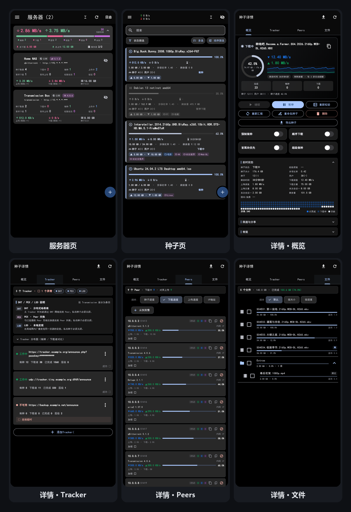

# TorrentManager

**English** | [简体中文](README.md)

> A **qBittorrent / Transmission remote torrent manager** built with Flutter + GetX (Android).
>
> Manage your LAN or public download servers from your phone: browse the torrent list with
> live speeds, add/remove torrents, manage trackers and file priorities, inspect peers and
> server logs, with full theme / wallpaper customization.
>
> Prebuilt APKs are available on the **Releases** page of this repository.
>
> Project home: <https://github.com/punk64/TorrentManager> — open source under the **MIT License**.

---

## ✨ Screenshots

> All rendered from real pages (445dp baseline, dark theme): server page, torrent page,
> and the four torrent-detail subpages.



---

## 1. Development Environment

| Item | Requirement | Source of truth |
| --- | --- | --- |
| Flutter | **3.47.4** stable | `revision` in `.metadata` |
| Dart SDK | `>=3.0.0 <4.0.0` | `environment.sdk` in `pubspec.yaml` |
| JDK | **17+** (21 tested) | `compileOptions` / Kotlin `jvmTarget` in `build.gradle.kts` |
| Android SDK | platform **37** | `compileSdk = 37` in `build.gradle.kts` |
| NDK | **28.2.13676358** | same file (explicit `ndkVersion`) |
| Android Gradle Plugin | **9.1.0** | `android/settings.gradle.kts` |
| Kotlin | **2.4.0** | same file |
| Gradle | **9.3.1** | `android/gradle/wrapper/gradle-wrapper.properties` |
| minSdk / targetSdk | Flutter defaults | `flutter.minSdkVersion` / `flutter.targetSdkVersion` referenced in `build.gradle.kts` |

> `android/local.properties` (SDK / Flutter paths) is generated by the Flutter toolchain on
> first build — **do not commit it by hand**.

---

## 2. Project Structure

```
lib/                  App source (73 files / ~27,200 lines)
  app/                Bootstrap & global wiring (6)
  controllers/        GetX controllers (5)
  data/               Data layer (12)
  pages/              Pages (15)
  utils/              Utilities (17)
  widgets/            Shared widgets (17)
  main.dart           Entry point
test/                 Unit / widget tests (69 files / ~15,700 lines)
android/              Android-only platform project
assets/images/        Icons + six wallpapers
pubspec.yaml          Dependencies & version
analysis_options.yaml Static analysis config
```

`lib/` is organized in six layers; only upward dependencies are allowed:

| Directory | Responsibility | Files |
| --- | --- | --- |
| `app/` | Bootstrap & global wiring | `main.dart` · `routes.dart` · `bindings.dart` · `theme.dart` · `page_style.dart` · `style_keys.dart` · `app_version.dart` |
| `controllers/` | Global state (GetX) | `server_controller.dart` · `torrent_controller.dart` · `theme_controller.dart` · `locale_controller.dart` · `auth_controller.dart` |
| `data/` | Data layer | `dio/log_interceptor.dart` · `dio/redirect_interceptor.dart` · `local/local_store.dart` · `local/secure_prefs.dart` · `models/` (`server_data` · `server_state` · `torrent` · `qb_log` · `qb_ip_filter`) · `prefs/server_prefs.dart` · `qbittorrent/qb_method.dart` · `transmission/tr_method.dart` |
| `pages/` | Pages | `server_list_page` (home) · `torrent_list_page` · `torrent_info_page` + four subpages (`_overview` / `_files` / `_peers` / `_trackers`) · `torrent_add_page` · `server_setting_page` · `server_dialog` · `theme_page` · `share_page` · `log_page` · `log_qb_page` · `drawer_page` |
| `utils/` | Utilities | `formatter` · `strings` · `i18n` / `i18n_en` · `app_log` / `log_scope` / `log_export` · `net_error` · `crypto_box` · `lan_detector` · `ip_geo` / `ip_geo_sources` · `startup_update` · `add_batch` · `file_export` · `theme_backup` · `update_check` |
| `widgets/` | Shared widgets | `auto_refresh` · `app_toast` · `bottom_panel` · `color_picker` · `draggable_fab` · `filtered_image` · `disk_io_chip` / `io_chip` · `list_loading_placeholder` · `log_selection` · `page_preview` / `theme_preview` · `server_stats_panel` · `slidable_tile` · `sort_filter_panel` · `speed_sparkline` · `arc_text` |

### Where key features live

| Capability | Location |
| --- | --- |
| Route table (9 `GetPage`) | `lib/app/routes.dart` |
| Dependency injection | `lib/app/bindings.dart` |
| Theme assembly (seed → light / dark `ThemeData`) | `lib/app/theme.dart` |
| qBittorrent client (Web API v2) | `lib/data/qbittorrent/qb_method.dart` |
| Transmission client (JSON-RPC) | `lib/data/transmission/tr_method.dart` |
| Server preference adapter (field names / unit conversion per client) | `lib/data/prefs/server_prefs.dart` |
| Session keep-alive & retry backoff | `lib/controllers/server_controller.dart` |
| LAN / WAN automatic routing | `lib/controllers/server_controller.dart` + `lib/utils/lan_detector.dart` |
| Peer IP geolocation (multi-source pool / shuffled rotation / failure cooldown) | `lib/utils/ip_geo.dart` + `lib/utils/ip_geo_sources.dart` |
| Error normalization (Dio exceptions → one human-readable line) | `lib/utils/net_error.dart` |
| In-app log bus | `lib/utils/app_log.dart` |
| Startup version check (detect + badge only, no dialogs) | `lib/utils/startup_update.dart` |
| Server list "totals card" | `lib/widgets/server_stats_panel.dart` |

---

## 3. Build & Run

```bash
flutter pub get                        # fetch dependencies
flutter run                            # debug on a device / emulator
flutter analyze                        # static analysis
flutter test                           # run tests (647 cases currently)
flutter build apk --release --split-per-abi --target-platform android-arm64
```

### One-command release

`release.py` in the repo root collapses the whole release flow into one command:

```bash
python release.py                  # build the version recorded in pubspec, then bump it
python release.py --dry-run        # print the plan only; no build, no writes
python release.py --version 0.3.0  # build a specific version
python release.py --debug-sign     # sign with the debug key (works without a keystore)
python release.py --verify-only    # run packaging assertions on existing artifacts only
python release.py --rehash         # regenerate the .sha1 sidecar for existing artifacts
```

It performs, in order: align the in-app version → build → rename to
`TorrentManager-V<version>-<abi>.apk` → generate a matching `.sha1` → run packaging
assertions on the artifact (so compression state / CRC / ABI purity / sidecar consistency)
→ advance `pubspec.yaml` and `kAppVersion` to the next version.

> The version number advances **only after a successful build with passing assertions**:
> a failed build does not consume a version, and re-running targets the same number.
> So there is normally no need to edit `pubspec.yaml` or `app_version.dart` by hand.

Two optional switches (also available as environment variables): `--mirror <dir>` copies the
artifacts (with `.sha1`) elsewhere after a successful build — an unavailable target only
warns and never blocks the release; `--log <file>` appends this build's version / size /
MD5 to a file.

Flutter and the Android SDK are located in this order: environment variables
(`FLUTTER_ROOT` / `ANDROID_SDK_ROOT`) → `PATH` → `android/local.properties`.

### Signing (release builds only)

The keystore defaults to `android/app/torrentmanager-release.jks`; alternatively point
`storeFile` in `key.properties` to your own file (relative paths resolve against
`android/app/`). Passwords are resolved in this priority order:

1. `android/key.properties` (recommended): copy `android/key.properties.example` to
   `key.properties` and fill in `storeFile` / `storePassword` / `keyPassword` / `keyAlias`;
2. Environment variables `TORRENTMANAGER_STORE_PASSWORD` / `TORRENTMANAGER_KEY_PASSWORD` / `TORRENTMANAGER_KEY_ALIAS`;
3. If both are missing, the passwords are empty and **release signing will fail**
   (debug builds via `flutter run` are unaffected).

> No keystore and just want to try the build? `python release.py --debug-sign` signs an
> installable build with the debug certificate. ⚠️ It **cannot be installed over a release
> build** (different signature; the installer will refuse).

> ⚠️ `key.properties` and `*.jks` are excluded from version control and distribution —
> keep them safe; once lost, no upgrade APK with the **same signature** can ever be
> produced again.

### Versioning

Two sources of truth must be **character-for-character identical**:

| Location | Meaning |
| --- | --- |
| `version:` in `pubspec.yaml` | `versionName+versionCode`, e.g. `0.2.10+33` |
| `kAppVersion` in `lib/app/app_version.dart` | The version name shown in the app; must equal the part before `+` |

> ⚠️ The `versionCode` (the number after `+`) **must be monotonically increasing** —
> Android uses it alone to tell old from new; downgrades are rejected by the installer
> with an "already installed a newer version" message. With `--split-per-abi`, each ABI
> gets an automatic offset.
>
> Both are aligned by `release.py` before the build and advanced together afterwards;
> no manual editing is needed in day-to-day work.

---

## 4. Build Configuration Notes

| Setting | Notes |
| --- | --- |
| R8 shrinking & obfuscation | `android/app/proguard-rules.pro`. Do **not** add broad rules like `-keep class androidx.**` / `io.flutter.**` — `-keep` also disables obfuscation and pins the whole dependency tree; measured `classes.dex` grew from ~1.1 MB to 4.3 MB |
| Signature schemes | v1(JAR) + v2 + v3 all forced on. AGP auto-disables v1 when `minSdk >= 24`, but some Chinese ROM installers still check the v1 certificate under `META-INF` |
| Native library packaging | `packaging.jniLibs.useLegacyPackaging` is the single source of truth (do **not** also set `extractNativeLibs` in the manifest; the two together break AGP 9). **Uncompressed by default**: `useLegacyPackaging = project.hasProperty("lite")` ⇒ libs stored STORED (mmap'd on device, single copy, lower on-disk usage), APK ≈ 22.82 MB. To halve download size (22.82 MB → ~11–13 MB, at the cost of an extra extracted copy at install time and +38% on-disk), pass `--android-project-arg=lite=true`. ⚠️ The only way to confirm the switch took effect is to inspect the compression state of the .so files in the artifact — the build still succeeds when the property is not passed; ⚠️ any change to this default **must be mirrored** in `release.py`'s assertion expectations (the two mirror each other; they desynced once and produced a successful build with guaranteed FAIL assertions) |
| Cleartext traffic | `android/app/src/main/res/xml/network_security_config.xml` — LAN servers often use plain http; allowed origins and rationale live in that file |
| Permissions | See `android/app/src/main/AndroidManifest.xml`; two storage permissions carry `maxSdkVersion` (Android 10+ uses scoped storage / SAF) |

---

## 5. Known Notes

1. **The update check source is this project's GitHub Releases**: `kUpdateCheckUrl` in
   `lib/app/app_version.dart` points to
   `api.github.com/repos/punk64/TorrentManager/releases/latest` — publishing a release with
   a `vX.Y.Z` tag is all it takes, **no extra version file to maintain**. Two silent
   degradations (the UI shows "already up to date", no error): (a) the repo has no
   releases yet, the API returns 404; (b) `api.github.com` is unreachable (common in
   mainland China networks). Switching sources means changing that single constant.
   ⚠️ The request **must carry a `User-Agent`**, otherwise GitHub replies 403.
2. **Startup update checks badge only, never interrupt**: each launch performs one
   automatic check (`lib/utils/startup_update.dart`) and **never shows a dialog** — the
   result is attached to the drawer's "Check for updates" entry (it turns into
   "Update available" when a new version exists); tapping it reveals details and a
   copyable release URL. One check per process; failures and "up to date" are both
   silent. The manual check in the drawer (`compareVersions`) remains available at any
   time; the two do not interfere.
3. **Peer geolocation uses a multi-source pool**: `lib/utils/ip_geo_sources.dart`
   registers Chinese and English source pools (the Chinese pool = domestic
   Chinese-first sources + international fallback; the English pool = all international
   sources; the pool follows the app language and switches instantly at runtime). To
   avoid rate limiting, each source has a minimum request interval and rotates via a
   shuffled bag; consecutive failures or 429/403 trigger a cooldown. Oversized responses
   are dropped unparser; displayed fields are sanitized (control characters,
   bidirectional overrides and zero-width characters removed), and loopback addresses
   are validated away so you never see someone else's dirty data. **Only the queried IP
   itself is sent**; private and reserved addresses are never sent. Adding a source is
   one more registration entry in that file.
4. **No server logs on the Transmission side**: its RPC spec has no log method, so the
   "server log" page shows **session diagnostics** (`session-get` / `session-stats`) with
   an explicit note when a Transmission server is selected.
5. **`lib/utils/i18n_en.dart` and `lib/utils/strings.dart` are paired text tables**: the
   former's keys must cover every key used by `L.t(...)` in the latter; a missing key
   falls back to the original Chinese. Keep them in sync.
6. The first build takes a while (first-time NDK / Gradle downloads and compilation) —
   that is normal.

---

## 6. License

Released under the **MIT License**; see [LICENSE](LICENSE) for the full text.

### Third-party assets & trademarks

`assets/images/qbittorrent.png` and `assets/images/transmission.png` are the official
logos of the [qBittorrent](https://www.qbittorrent.org/) and
[Transmission](https://transmissionbt.com/) projects respectively,
**copyrighted by their respective projects and NOT covered by this repository's MIT
license**; they are used here solely to identify the connected server type in the UI.

qBittorrent and Transmission are names and trademarks of their respective owners. This
project is **not affiliated with, sponsored by, or endorsed by** either of them; it is an
independently developed third-party remote management client that communicates only
through their public RPC interfaces.
